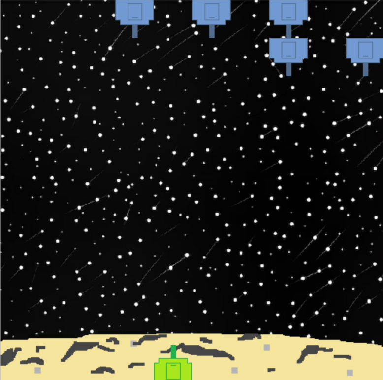
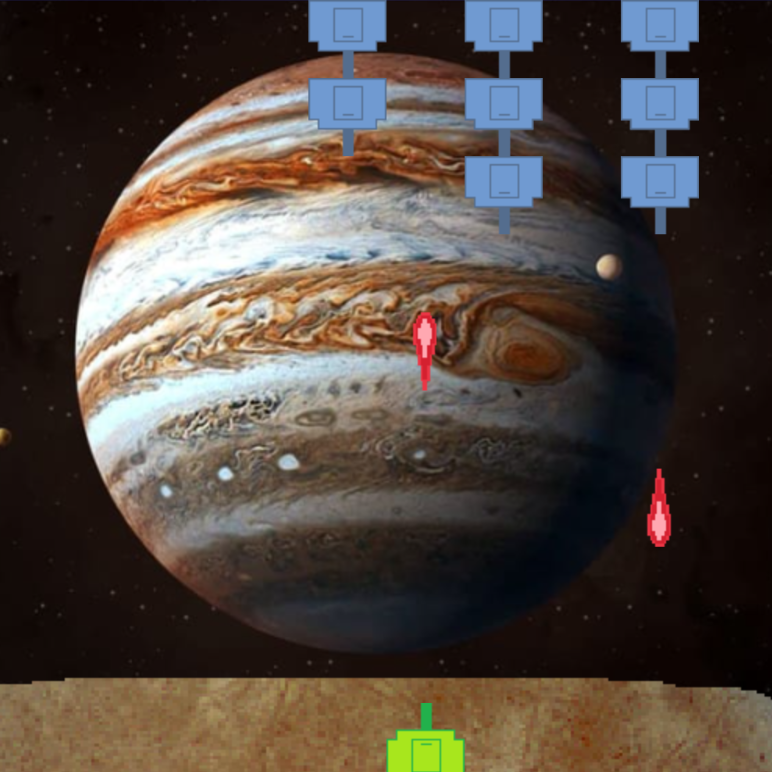
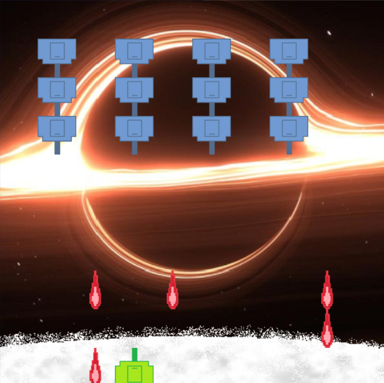

# Space Invaders

## Equipo de desarrollo

- Obeid Nestor
- Silvero Owen
- Milinelli Maximiliano
- Ponce Naara

## Capturas

## Reglas de Juego / Instrucciones

En el juego eres una nave futurista que dispara proyectiles.
Debes proteger la galaxia de las naves enemigas.
Pasarás por 3 distintas zonas, cada una más dificil que la anterior.

Movimiento: flecha izquierda y flecha derecha
Disparar: espacio

El juego termina cuando, o el jugador es alcanzado por un proyectil o por una nave enemiga, o una nave enemiga llega a la zona que el jugador debe proteger.

## Otros

- Unahur, comisión 1b
- Versión de wollok 0.2.8
- Una vez terminado, no tenemos problemas en que el repositorio sea público
